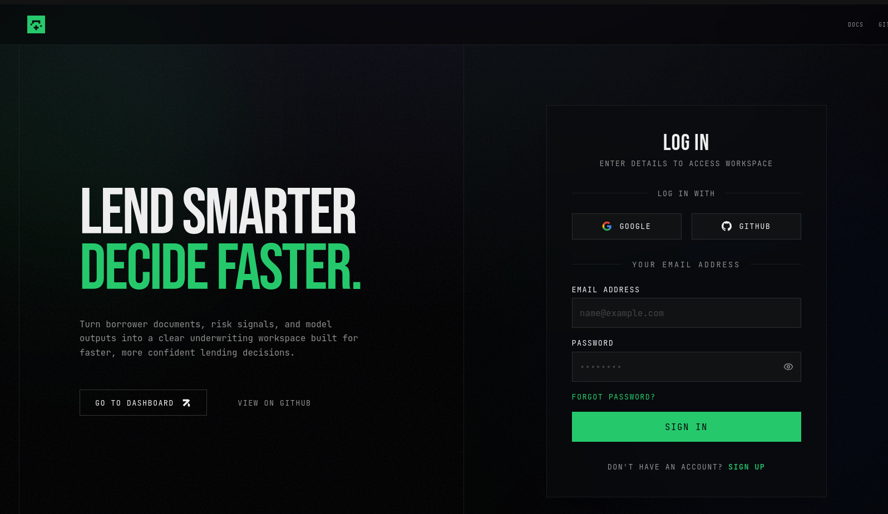
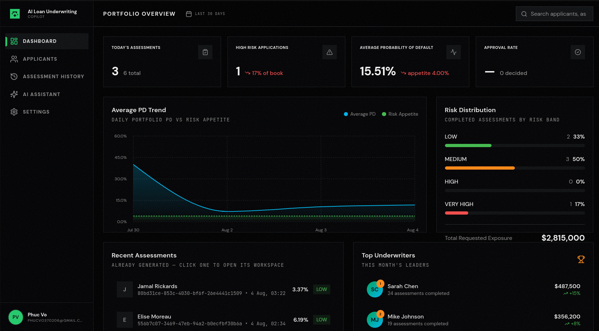
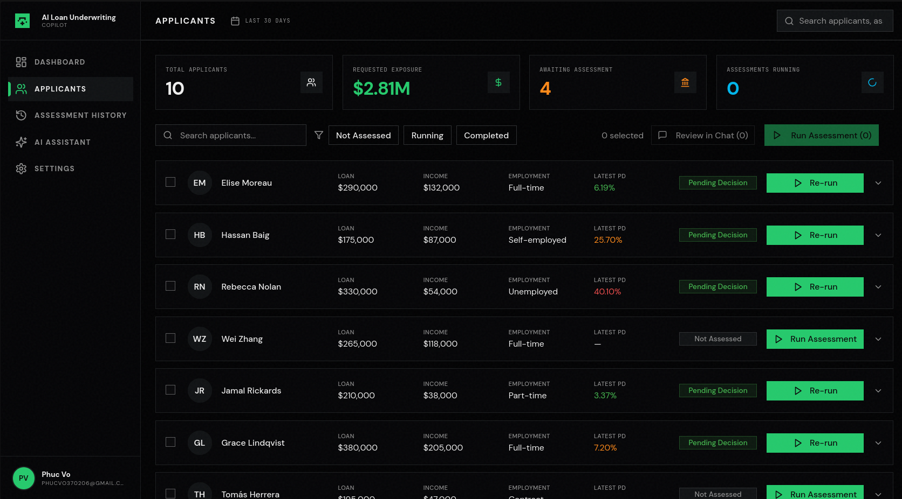
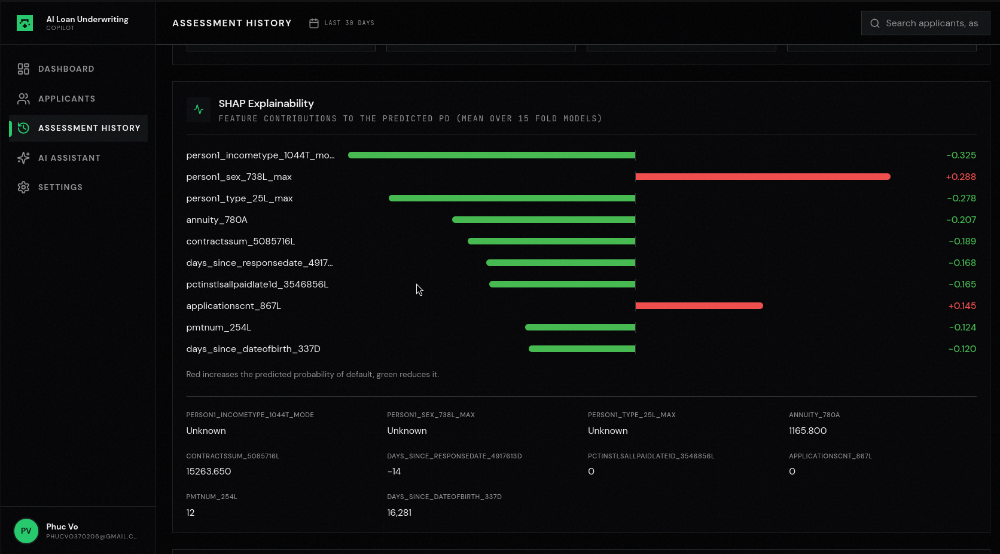
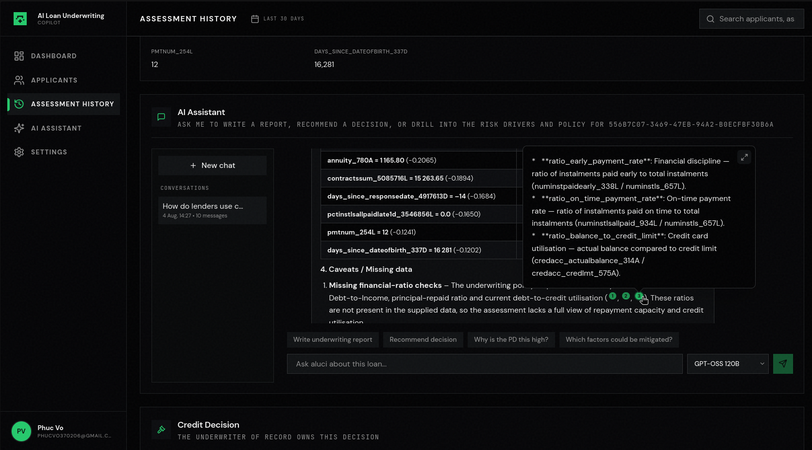
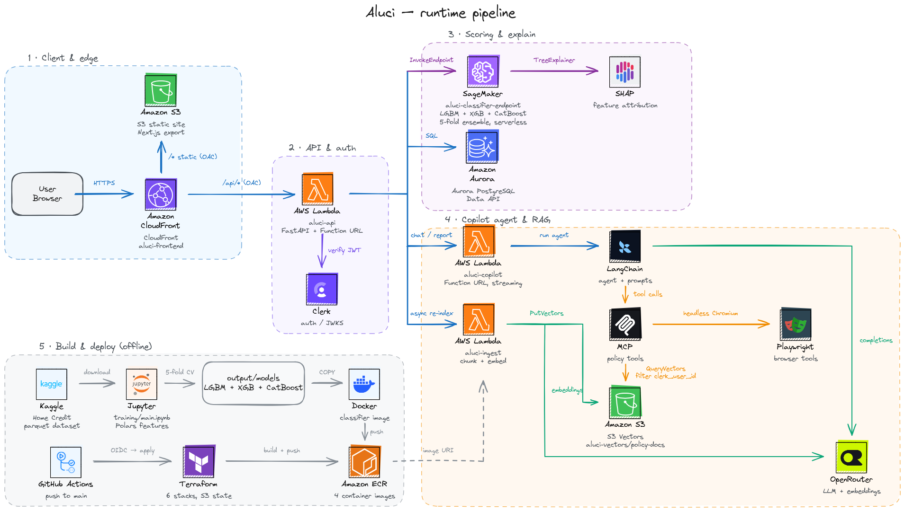

<div align="center">


# Aluci

**An underwriting workspace for consumer lending.**
Probability of default in one call, the SHAP reasons behind it, and a copilot that
answers with your own credit policy quoted back at you.


### [Architecture](#architecture) | [Deploy](#deploying) | [Deployment guides](guides/) | [Training notebook](training/main.ipynb)



</div>

## Why Aluci?

Underwriters get a number from a model they cannot question. Aluci gives them the
number, the reason for it, and a copilot that can argue about it against the
lender's actual policy documents — in one workspace, fully serverless.

| | |
|---|---|
| **A score you can defend** | LightGBM, XGBoost and CatBoost — five folds each — vote on a single probability of default. |
| **Reasons, not a black box** | TreeExplainer SHAP per feature, averaged over the folds, shown next to the raw values that produced it. |
| **Policy the model never saw** | Upload the credit policy as PDF; it is chunked into S3 Vectors and retrieved per tenant, so the copilot answers with quotes, not vibes. |
| **The memo written for you** | The agent drafts the underwriting report, recommends approve / decline, and cites the passages it leaned on. |
| **Portfolio, not one case** | Daily PD trend against risk appetite, risk-band mix, exposure and recent assessment runs. |
| **No servers to babysit** | CloudFront, Lambda, serverless SageMaker, Aurora Serverless v2 — six ordered Terraform stacks, scales to zero. |

## Screenshots

<table>
<tr>
<td width="50%"></td>
<td width="50%"></td>
</tr>
<tr valign="top">
<td width="50%"><b>Portfolio overview</b> — daily PD trend against risk appetite, risk-band distribution, exposure and recent runs.</td>
<td width="50%"><b>Applicants</b> — the book, with per-applicant PD, status and one-click (re-)assessment.</td>
</tr>
<tr>
<td width="50%"></td>
<td width="50%"></td>
</tr>
<tr valign="top">
<td width="50%"><b>Explainability</b> — SHAP contributions per feature, averaged across folds, next to the raw values that produced them.</td>
<td width="50%"><b>Copilot</b> — writes the underwriting report, recommends a decision and cites the policy it used.</td>
</tr>
</table>

## Architecture



<sub>Source diagram: [assets/pipeline.excalidraw](assets/pipeline.excalidraw)</sub>

**1 · Client & edge.** A Next.js static export sits in S3; CloudFront serves it and
also fronts the API Lambda. Both origins are locked behind Origin Access Control,
so neither the bucket nor the Function URL is reachable directly.

**2 · API & auth.** `aluci-api` is a FastAPI app on a Lambda Function URL. Clerk
issues the session JWT; the API verifies it against Clerk's JWKS on every request
and scopes all data by `clerk_user_id`.

**3 · Scoring & explain.** `aluci-classifier-endpoint` is a serverless SageMaker
endpoint holding LightGBM + XGBoost + CatBoost, 5 folds each. It returns the
averaged PD plus TreeExplainer SHAP values. Applicants, assessments, decisions and
chat history live in Aurora PostgreSQL, reached over the RDS Data API.

**4 · Copilot agent & RAG.** `aluci-copilot` is a LangGraph state machine on a
Lambda Function URL in `RESPONSE_STREAM` mode. Its tools arrive over MCP: policy
retrieval from S3 Vectors (filtered by `clerk_user_id`) and a headless-Chromium
Playwright browser. The API invokes `aluci-ingest` to chunk and embed uploaded
policy PDFs into the same index. OpenRouter serves both the chat model and the
`text-embedding-3-small` embeddings.

**5 · Build & deploy (offline).** Training never touches the runtime path: the Home
Credit parquet dataset goes through `training/main.ipynb` (Polars features, 5-fold
CV), the fold models land in `output/models/`, and they are `COPY`-ed into the
classifier image. Each service has a `deploy.py` that builds its image, pushes it
to ECR and hands the digest to Terraform as a variable — run by hand, or by the
[infra workflow](.github/workflows/infra.yml) in GitHub Actions.

## Repository layout

Every directory under `backend/` is one container image and one AWS resource:

| Path | Ships as | Does |
|---|---|---|
| [backend/api/](backend/api/) | `aluci-api` Lambda | FastAPI: routes, Clerk JWT verification, orchestration |
| [backend/classifier/](backend/classifier/) | SageMaker endpoint | Feature build, 15-model ensemble, SHAP |
| [backend/copilot/](backend/copilot/) | `aluci-copilot` Lambda | Streaming LangGraph agent + MCP server |
| [backend/ingest/](backend/ingest/) | `aluci-ingest` Lambda | Chunks and embeds policy PDFs into S3 Vectors |
| [backend/database/](backend/database/) | — (imported by the API) | Aurora schema, migrations, seed, Data API client |
| [frontend/](frontend/) | S3 + CloudFront | Next.js static export (Clerk, Tailwind, shadcn/ui, Recharts) |

Everything else is offline or infrastructure:

| Path | Contents |
|---|---|
| [training/main.ipynb](training/main.ipynb) | Polars feature engineering, 5-fold CV, model export |
| [output/](output/) | `models/` fold artifacts baked into the classifier image, `logs/` per-fold AUC/Gini, `curated/`, `submissions/` |
| [terraform/](terraform/) | Six ordered stacks, `1_sagemaker` → `6_frontend` |
| [guides/](guides/) | One deployment guide per stack, plus [IAM permissions](guides/0_permissions.md) and [GitHub Actions](guides/7_github_actions.md) |

## Deploying

The six Terraform stacks are ordered and each has a matching guide in
[guides/](guides/) — including the IAM policy that phase needs. Start at
[guides/0_permissions.md](guides/0_permissions.md), then apply in order:

```bash
cd terraform/1_sagemaker && terraform init && terraform apply
# ... 2_ingestion, 3_copilot, 4_database, 5_api, 6_frontend
```

Each stack writes its state to S3 and exposes the outputs the next one consumes.
