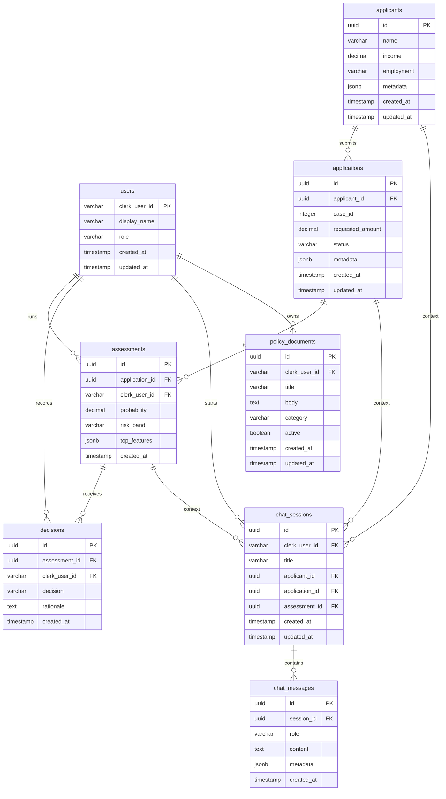

# 4. Deploy the Aurora database

This phase creates the Aurora PostgreSQL Serverless v2 cluster `aluci-aurora-cluster`, its instance `aluci-aurora-instance-1`, a Secrets Manager secret holding the generated credentials, and a subnet group plus security group in the default VPC.

Everything talks to Aurora through the RDS Data API, so the backend needs only `AURORA_CLUSTER_ARN`, `AURORA_SECRET_ARN`, and `AURORA_DATABASE` — no connection string, no VPC networking on the Lambda side.

All commands assume you start from the repository root.

## Permission policy

Add this as an inline policy named `AluciDatabasePolicy` on the `AluciAccess` group, alongside the earlier ones. Do not replace them — the group accumulates.

Replace `673222099674` with your account id and `ap-southeast-1` with your region if they differ.

```json
{
    "Version": "2012-10-17",
    "Statement": [
        {
            "Sid": "TerraformVpcAndNetworkRead",
            "Effect": "Allow",
            "Action": [
                "ec2:DescribeVpcs",
                "ec2:DescribeVpcAttribute",
                "ec2:DescribeSubnets",
                "ec2:DescribeSecurityGroups",
                "ec2:DescribeSecurityGroupRules",
                "ec2:DescribeNetworkInterfaces",
                "ec2:CreateSecurityGroup",
                "ec2:DeleteSecurityGroup",
                "ec2:AuthorizeSecurityGroupEgress",
                "ec2:RevokeSecurityGroupEgress",
                "ec2:CreateTags"
            ],
            "Resource": "*"
        },
        {
            "Sid": "TerraformRdsAurora",
            "Effect": "Allow",
            "Action": [
                "rds:CreateDBCluster",
                "rds:DeleteDBCluster",
                "rds:ModifyDBCluster",
                "rds:DescribeDBClusters",
                "rds:DescribeGlobalClusters",
                "rds:CreateDBInstance",
                "rds:DeleteDBInstance",
                "rds:ModifyDBInstance",
                "rds:DescribeDBInstances",
                "rds:CreateDBSubnetGroup",
                "rds:DeleteDBSubnetGroup",
                "rds:ModifyDBSubnetGroup",
                "rds:DescribeDBSubnetGroups",
                "rds:AddTagsToResource",
                "rds:ListTagsForResource"
            ],
            "Resource": "*"
        },
        {
            "Sid": "TerraformSecretsManager",
            "Effect": "Allow",
            "Action": [
                "secretsmanager:CreateSecret",
                "secretsmanager:DeleteSecret",
                "secretsmanager:DescribeSecret",
                "secretsmanager:GetResourcePolicy",
                "secretsmanager:ListSecretVersionIds",
                "secretsmanager:GetSecretValue",
                "secretsmanager:PutSecretValue",
                "secretsmanager:UpdateSecret",
                "secretsmanager:TagResource"
            ],
            "Resource": "*"
        },
        {
            "Sid": "RunDataApiStatements",
            "Effect": "Allow",
            "Action": [
                "rds-data:ExecuteStatement",
                "rds-data:BatchExecuteStatement",
                "rds-data:BeginTransaction",
                "rds-data:CommitTransaction",
                "rds-data:RollbackTransaction"
            ],
            "Resource": "arn:aws:rds:ap-southeast-1:673222099674:cluster:aluci-aurora-cluster"
        }
    ]
}
```

`RunDataApiStatements` is what lets the migration, seed, and verification scripts later in this guide run from your terminal — it is not needed by Terraform itself. The deployed API Lambda gets its own copy of those actions from the role Terraform creates in phase 5.

EC2, RDS, and Secrets Manager use `Resource: "*"` because Terraform reads and creates several generated ARNs (subnet ids, security group ids, the suffixed secret name) during the apply. `sts:GetCallerIdentity` already comes from `AluciSageMakerPolicy`.

## Configure local variables

```bash
export AWS_REGION=ap-southeast-1
export AWS_DEFAULT_REGION=ap-southeast-1
cp terraform/4_database/terraform.tfvars.example terraform/4_database/terraform.tfvars
```

```hcl
aws_region   = "ap-southeast-1"
min_capacity = 0.5
max_capacity = 1.0
```

The cluster identifier, database name (`aluci`), and master username are fixed in `main.tf`; changing them would force a cluster replacement and lose the data. Aurora Serverless v2 bills for the minimum ACUs while the cluster is provisioned, so destroy this phase when you are done experimenting.

## Deploy Aurora

```bash
cd terraform/4_database
terraform init
terraform apply
```

This takes several minutes — cluster, instance, subnet group, security group, and secret all come up in sequence.

```bash
terraform output -raw aurora_cluster_arn
terraform output -raw aurora_secret_arn
terraform output -raw aurora_database
```

```txt
arn:aws:rds:ap-southeast-1:123456789012:cluster:aluci-aurora-cluster
arn:aws:secretsmanager:ap-southeast-1:123456789012:secret:aluci-aurora-credentials-...
aluci
```

## Save configuration to .env

In the Part 4 section of your root `.env`, set `AURORA_CLUSTER_ARN` and `AURORA_SECRET_ARN` to the Terraform outputs above. Both change whenever this phase is destroyed and recreated. Leave everything else in that section as `.env.example` ships it.

Do not paste the generated database password into `.env`. It stays in Secrets Manager; every caller reads it through the Data API using `AURORA_SECRET_ARN`.

## Smoke test the Data API

```bash
aws rds-data execute-statement \
  --resource-arn "$(cd terraform/4_database && terraform output -raw aurora_cluster_arn)" \
  --secret-arn "$(cd terraform/4_database && terraform output -raw aurora_secret_arn)" \
  --database aluci \
  --sql "SELECT version()"
```

Expected: a JSON response containing the PostgreSQL version.

## Create the schema and load sample data

The scripts live in the `backend/database` package and read the Aurora values from the root `.env`:

```bash
cd backend/database
uv sync
uv run run_migrations.py
uv run test_data_api.py
uv run seed_data.py
uv run verify_database.py
```

Expected output, in order:

```txt
Migration completed successfully.
Data API connected to database: aluci
Seeded 1 user, 10 applicants, 10 applications, 3 assessments, and 4 policy documents.
Aluci database verification
...
```

`verify_database.py` prints a row count for each of the eight tables plus the index and trigger counts. `reset_db.py` does the whole cycle again from scratch — it drops every table, re-runs the migration, re-seeds, and verifies.

## Understanding the database schema

Eight tables cover users, borrowers, loan applications, model assessments, underwriting decisions, chat history, and policy documents. The important domain split:

- `applicants` are people or businesses applying for credit.
- `applications` are specific loan requests from an applicant.
- `assessments` are model scoring runs for one application.
- `decisions` are human underwriting outcomes for one assessment.
- `policy_documents` are user-owned policy sources for Copilot/RAG.



### Table descriptions

- **users**: Minimal profile keyed by the Clerk user id. Clerk still handles authentication; this row exists so the other tables have a foreign key to point at, which is why the API calls `db.users.ensure()` on every authenticated request.
- **applicants**: Borrower identity and attributes — name, income, employment type, and free-form metadata (the seed script parks the model's feature row here).
- **applications**: One requested loan for an applicant: `case_id`, requested amount, workflow status, metadata. One applicant can have many applications. `case_id` is uniquely indexed where not null, so it can be matched back to the classifier's test data.
- **assessments**: Model risk results for an application — default probability, risk band, and top SHAP features in JSONB. Rerunning the model adds a row rather than replacing one.
- **decisions**: Human underwriting outcomes linked to an assessment, with optional rationale. Downstream of assessments, not attached directly to applicants.
- **chat_sessions** / **chat_messages**: Copilot conversation threads and their messages. A session can be tied to an applicant, application, or assessment so the UI can restore context.
- **policy_documents**: User-owned policy text. List, upload, delete, re-ingestion, and Copilot retrieval all stay scoped to `clerk_user_id`; the matching S3 Vectors records carry the same id in their metadata and every query filters on it.

Note that `applicants` and `applications` deliberately carry no `clerk_user_id` — the borrower queue is shared across underwriters. Ownership starts at `assessments`, where a specific underwriter scores a specific application.

### Workflow relationships

The pending underwriting queue loads from `applications`, not `applicants`: a pending case is an application with no downstream decision yet. That stays correct when one borrower submits multiple loan requests.

1. An underwriter creates or imports an `applicants` row for the borrower.
2. The requested loan becomes an `applications` row linked by `applicant_id`.
3. A scoring run creates an `assessments` row linked by `application_id`.
4. The underwriter records a `decisions` row linked by `assessment_id`.
5. Copilot history attaches to the applicant, application, or assessment depending on conversation context.

Policy documents follow their own path: an underwriter uploads one, the API stores it in `policy_documents` under that user, re-ingestion reads only that user's active rows, the vector index stores the user id as metadata, and Copilot retrieval filters on it.

The migration also creates indexes for the common lookups and `updated_at` triggers on the five mutable tables.

## Troubleshooting

`AccessDenied` on EC2 networking during apply — confirm `AluciDatabasePolicy` is attached to `AluciAccess` and includes `TerraformVpcAndNetworkRead`.

`UnauthorizedOperation` on `ec2:DescribeNetworkInterfaces` while deleting a security group — the provider always sweeps attached network interfaces before removing a security group, so this grant is needed on destroy even though nothing creates an interface.

`AccessDenied` on `rds:CreateDBCluster` or `rds:DescribeGlobalClusters` — confirm the `TerraformRdsAurora` statement is present. `DescribeGlobalClusters` is only called during refresh and destroy, so a missing grant shows up later than the others.

`AccessDenied` on `rds-data:ExecuteStatement` — the `RunDataApiStatements` statement is missing, or its cluster ARN does not match your account and region.

`Missing required Aurora configuration` — the Part 4 values are not in the root `.env` yet, or you are running from a directory where `.env` is not found. Every script in `backend/database` raises this through the same `DataAPIClient` constructor.

`relation "users" does not exist` from a migration statement — the run before it failed partway. Re-run `uv run run_migrations.py`; every statement is `IF NOT EXISTS`, so a second pass is safe and only creates what is missing.

Aurora creation fails because no default VPC or subnets exist — either recreate the default VPC in that region, or edit `terraform/4_database/main.tf` to use explicit subnet ids instead of the `aws_vpc`/`aws_subnets` data sources.

## Continue

Once migrations, seed, and verification all pass, continue to `guides/5_api.md`.
