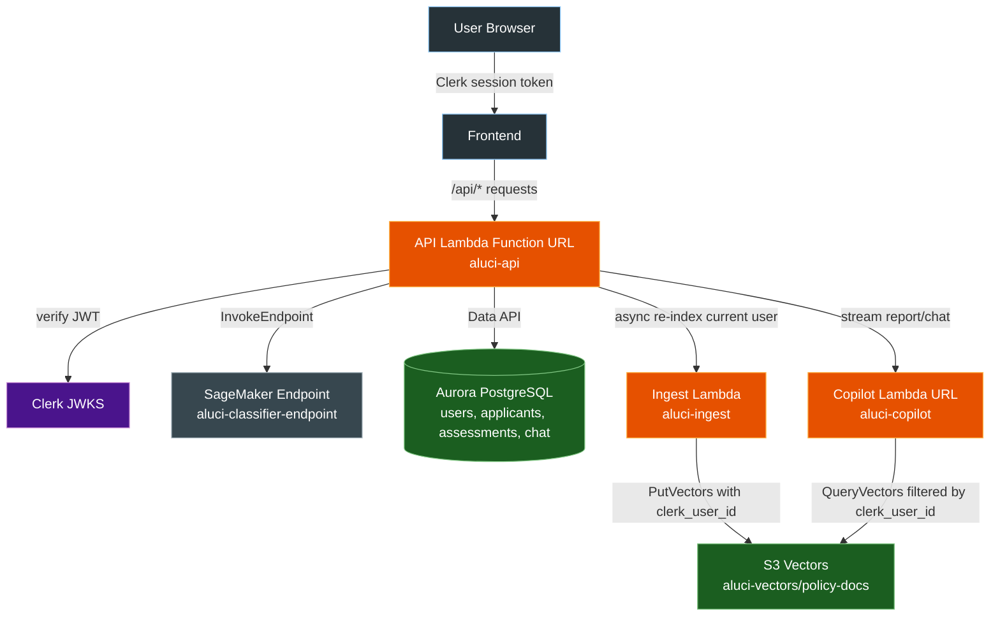

# 5. Deploy the API service

This phase creates the ECR repository `aluci-api`, the execution role `aluci-api-lambda-role`, and — once the image exists — the `aluci-api` Lambda behind a streaming Function URL.

The API service is the application boundary for the frontend. It verifies Clerk JWTs, calls the SageMaker classifier, stores history in Aurora, relays Copilot streaming responses, and re-indexes policy documents through the ingestion Lambda. The browser never reaches those services directly.

Terraform runs twice, same as phases 1 to 3: base resources first, then again from the deploy script with the pushed image URI.

All commands assume you start from the repository root.

## How the API works



- `GET /health` — which dependencies are configured. The only unauthenticated route.
- `POST /api/predict` — calls SageMaker, returns probability plus top features.
- `/api/assessments`, `/api/decisions`, `/api/sessions` — read and write Aurora through the RDS Data API.
- `/api/policy` and `/api/report` — relay streaming responses from the Copilot Function URL. `/api/report` takes `kind: "report"` or `kind: "recommend"` and forwards to the matching Copilot route.
- `/api/rag/upload` and `/api/rag/documents/{id}` — update the current user's Aurora policy documents, then invoke the ingestion Lambda to refresh that user's S3 Vectors entries.

## Permission policy

Add this as an inline policy named `AluciApiPolicy` on the `AluciAccess` group, alongside the earlier ones. Do not replace them — the group accumulates.

Replace `673222099674` with your account id and `ap-southeast-1` with your region if they differ.

```json
{
    "Version": "2012-10-17",
    "Statement": [
        {
            "Sid": "ManageApiEcr",
            "Effect": "Allow",
            "Action": [
                "ecr:CreateRepository",
                "ecr:DeleteRepository",
                "ecr:DescribeRepositories",
                "ecr:ListTagsForResource",
                "ecr:TagResource",
                "ecr:UntagResource",
                "ecr:BatchCheckLayerAvailability",
                "ecr:InitiateLayerUpload",
                "ecr:UploadLayerPart",
                "ecr:CompleteLayerUpload",
                "ecr:PutImage",
                "ecr:BatchGetImage",
                "ecr:GetDownloadUrlForLayer"
            ],
            "Resource": "arn:aws:ecr:ap-southeast-1:673222099674:repository/aluci-api"
        },
        {
            "Sid": "ManageApiIamRole",
            "Effect": "Allow",
            "Action": [
                "iam:CreateRole",
                "iam:DeleteRole",
                "iam:GetRole",
                "iam:TagRole",
                "iam:UntagRole",
                "iam:ListInstanceProfilesForRole",
                "iam:PutRolePolicy",
                "iam:GetRolePolicy",
                "iam:DeleteRolePolicy",
                "iam:ListRolePolicies",
                "iam:ListAttachedRolePolicies"
            ],
            "Resource": "arn:aws:iam::673222099674:role/aluci-api-lambda-role"
        },
        {
            "Sid": "PassApiRoleToLambda",
            "Effect": "Allow",
            "Action": [
                "iam:PassRole"
            ],
            "Resource": "arn:aws:iam::673222099674:role/aluci-api-lambda-role",
            "Condition": {
                "StringEquals": {
                    "iam:PassedToService": "lambda.amazonaws.com"
                }
            }
        },
        {
            "Sid": "AttachLambdaBasicExecution",
            "Effect": "Allow",
            "Action": [
                "iam:AttachRolePolicy",
                "iam:DetachRolePolicy"
            ],
            "Resource": "arn:aws:iam::673222099674:role/aluci-api-lambda-role",
            "Condition": {
                "ArnEquals": {
                    "iam:PolicyARN": "arn:aws:iam::aws:policy/service-role/AWSLambdaBasicExecutionRole"
                }
            }
        },
        {
            "Sid": "ManageApiLambda",
            "Effect": "Allow",
            "Action": [
                "lambda:CreateFunction",
                "lambda:DeleteFunction",
                "lambda:GetFunction",
                "lambda:GetFunctionConfiguration",
                "lambda:ListVersionsByFunction",
                "lambda:UpdateFunctionCode",
                "lambda:UpdateFunctionConfiguration",
                "lambda:ListTags",
                "lambda:TagResource",
                "lambda:UntagResource",
                "lambda:CreateFunctionUrlConfig",
                "lambda:GetFunctionUrlConfig",
                "lambda:UpdateFunctionUrlConfig",
                "lambda:DeleteFunctionUrlConfig",
                "lambda:AddPermission",
                "lambda:RemovePermission",
                "lambda:GetPolicy"
            ],
            "Resource": "arn:aws:lambda:ap-southeast-1:673222099674:function:aluci-api"
        },
        {
            "Sid": "AllowSageMakerPrediction",
            "Effect": "Allow",
            "Action": [
                "sagemaker:InvokeEndpoint"
            ],
            "Resource": "arn:aws:sagemaker:ap-southeast-1:673222099674:endpoint/aluci-classifier-endpoint"
        },
        {
            "Sid": "AllowAuroraRDSDataAPI",
            "Effect": "Allow",
            "Action": [
                "rds-data:ExecuteStatement",
                "rds-data:BatchExecuteStatement",
                "rds-data:BeginTransaction",
                "rds-data:CommitTransaction",
                "rds-data:RollbackTransaction"
            ],
            "Resource": "arn:aws:rds:ap-southeast-1:673222099674:cluster:aluci-aurora-cluster"
        },
        {
            "Sid": "AllowSecretsManagerAccess",
            "Effect": "Allow",
            "Action": [
                "secretsmanager:GetSecretValue"
            ],
            "Resource": "arn:aws:secretsmanager:ap-southeast-1:673222099674:secret:aluci-aurora-credentials-*"
        }
    ]
}
```

`ecr:GetAuthorizationToken` and `sts:GetCallerIdentity` already come from `AluciSageMakerPolicy`, which is why they are not repeated here.

`lambda:AddPermission`, `lambda:RemovePermission`, and `lambda:GetPolicy` are here but not in `AluciCopilotPolicy` because this Function URL starts at `authorization_type = "NONE"`. That mode needs a resource-based policy on the function, and phase 6 needs `RemovePermission` to tear it down when the URL switches to `AWS_IAM`.

The last three statements are runtime access the Lambda inherits from its own role, repeated here so the smoke tests below work from your terminal.

## Configure local variables

```bash
export AWS_REGION=ap-southeast-1
export AWS_DEFAULT_REGION=ap-southeast-1
cp terraform/5_api/terraform.tfvars.example terraform/5_api/terraform.tfvars
```

```hcl
aws_region    = "ap-southeast-1"
api_image_uri = ""

classifier_endpoint_name = "aluci-classifier-endpoint"
copilot_url              = "https://...lambda-url.ap-southeast-1.on.aws/"

aurora_cluster_arn = "arn:aws:rds:ap-southeast-1:123456789012:cluster:aluci-aurora-cluster"
aurora_secret_arn  = "arn:aws:secretsmanager:ap-southeast-1:123456789012:secret:aluci-aurora-credentials-..."
aurora_database    = "aluci"

clerk_jwks_url = "https://your-clerk-domain/.well-known/jwks.json"

ingest_function_name = "aluci-ingest"
cors_origins         = "http://localhost:3000"

function_url_auth_type = "NONE"
```

Everything except `clerk_jwks_url` comes from earlier phases:

```bash
(cd terraform/1_sagemaker && terraform output -raw classifier_endpoint_name)
(cd terraform/2_ingestion && terraform output -raw ingest_function_name)
(cd terraform/3_copilot && terraform output -raw copilot_url)
(cd terraform/4_database && terraform output -raw aurora_cluster_arn)
(cd terraform/4_database && terraform output -raw aurora_secret_arn)
```

`clerk_jwks_url` is the JWKS endpoint of the same Clerk instance your frontend uses.

Keep `api_image_uri` empty for the first apply — the deploy script fills it later. Keep `function_url_auth_type = "NONE"` for this phase; the URL has to be publicly reachable for the smoke tests, and `guides/6_frontend.md` switches it to `AWS_IAM` once CloudFront exists. An empty `ingest_function_name` leaves `/health` reporting `ingest_configured: false` and policy upload and delete stop refreshing the vector index.

## Phase 1: create ECR and IAM

```bash
cd terraform/5_api
terraform init
terraform apply
terraform output -raw ecr_repository_url   # ...dkr.ecr.ap-southeast-1.amazonaws.com/aluci-api
```

No Lambda exists yet — `api_image_uri` is still empty, which is expected.

## Phase 2: build, push, deploy the Function URL

```bash
python backend/api/package_docker.py
```

The script reads the ECR URL from Terraform output, builds `backend/api/Dockerfile` for `linux/amd64`, pushes it, writes the pushed image into `terraform.tfvars`, then re-runs Terraform. Because the image lands in the file rather than a `-var`, a later plain `terraform apply` here keeps the Lambda instead of destroying it.

```bash
cd terraform/5_api
terraform output -raw api_function_url   # https://xyz123.lambda-url.ap-southeast-1.on.aws/
```

## Save configuration to .env

In the Part 5 section of your root `.env`, set `COPILOT_URL` and `CLERK_JWKS_URL`. Leave everything else in that section as `.env.example` ships it.

`COPILOT_URL` is the phase 3 Copilot Function URL, not the API URL from this phase. The API uses it server-to-server when relaying `/api/policy` and `/api/report`.

## Smoke test

```bash
API_FUNCTION_URL=$(cd terraform/5_api && terraform output -raw api_function_url)
curl "${API_FUNCTION_URL%/}/health"
```

Expected: every dependency reports configured.

```json
{"service":"Aluci Copilot API","status":"healthy","classifier_configured":true,"copilot_configured":true,"ingest_configured":true,"aurora_configured":true}
```

Every other route needs a Clerk bearer token, which the browser sends automatically once the frontend is running. To test by hand, take a session token from your Clerk instance:

```bash
curl "${API_FUNCTION_URL%/}/api/applications" -H "Authorization: Bearer <clerk-session-token>"
```

Expected: JSON with the seeded applications.

## Point the frontend at the deployed API

`frontend/lib/config.ts` reads `NEXT_PUBLIC_API_URL` only when the page is served from `localhost` or an IP address. Running the backend locally needs nothing from this phase — the variable defaults to `http://localhost:8000`. To browse locally against the deployed API, put the Function URL in `frontend/.env.local`:

```txt
NEXT_PUBLIC_API_URL=https://xxxxxxxx.lambda-url.ap-southeast-1.on.aws
```

Edit the file by hand and keep a single such line. This is a cross-origin call, so `cors_origins` in `terraform/5_api/terraform.tfvars` must list the origin you browse from.

`guides/6_frontend.md` closes this Function URL in its last step; from then on the value has to be the CloudFront URL. A frontend served from CloudFront ignores the variable entirely and calls `/api/*` on its own origin.

## Troubleshooting

`AccessDenied` on ECR, `iam:PassRole`, or Lambda — confirm `AluciApiPolicy` is on the `AluciAccess` group and that the account id and region in the ARNs match your deployment.

`/health` reports a dependency as `false` — the matching value in `terraform/5_api/terraform.tfvars` is empty or wrong. `classifier_endpoint_name` comes from phase 1, `copilot_url` from phase 3, `aurora_cluster_arn` and `aurora_secret_arn` from phase 4.

`401` or `403` on an authenticated route — verify `clerk_jwks_url` in `terraform.tfvars` and `CLERK_JWKS_URL` in `.env` point at the same Clerk instance that issued the token.

`AccessDenied` on SageMaker, Aurora, or Secrets Manager from inside a route — the API Lambda's own role is missing the grant, not your user. Re-apply this phase.

`/api/report` or `/api/policy` returns `403` while `/api/predict` works — the API Lambda role is missing `lambda:InvokeFunction` on `aluci-copilot`. `invoke_mode = "RESPONSE_STREAM"` means a call through the Function URL is also an invocation of the function, so `lambda:InvokeFunctionUrl` alone is not enough.

Policy upload or delete succeeds in Aurora but the vector index does not change — check `ingest_function_name = "aluci-ingest"` and that the API Lambda role can invoke it.

## Continue

Once `/health` is green and an authenticated route returns data, continue to `guides/6_frontend.md`.
