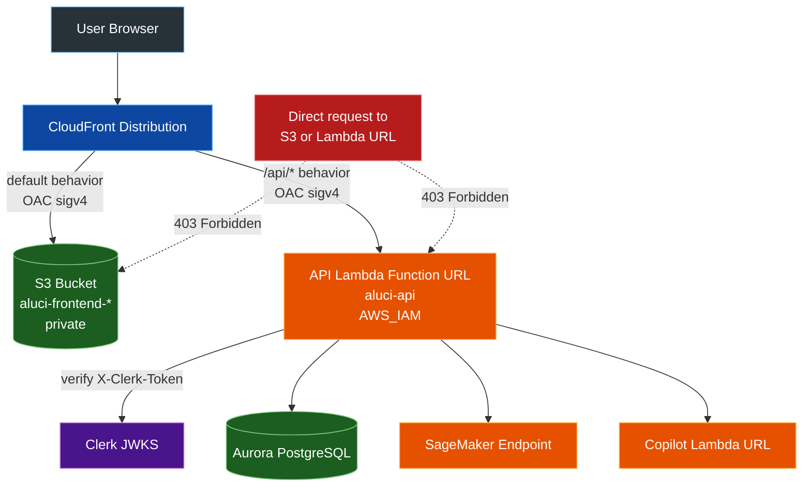

# 6. Deploy the frontend

This phase creates the S3 bucket `aluci-frontend-<account-id>`, two Origin Access Controls (`aluci-frontend-oac` for S3, `aluci-api-oac` for Lambda), the CloudFront distribution that serves the static site and proxies `/api/*` to the API Lambda, and the Lambda permission that lets CloudFront — and only CloudFront — reach the API Function URL.

The frontend is a Next.js static export (`output: "export"`). There is no Node server in production: `npm run build` writes plain HTML/CSS/JS into `frontend/out`, the deploy script syncs that folder to S3, and CloudFront serves it.

This phase also closes the Function URL from phase 5. After the last step it answers only requests signed by your distribution.

All commands assume you start from the repository root.

## How the frontend works

One distribution serves two origins. The browser only ever talks to CloudFront.



Two behaviors are configured on the distribution:

- **Default behavior** serves the static export from S3, cached for one hour. Unknown paths return 404, and `custom_error_response` rewrites that to `/index.html` with status 200 so client-side routes still load. Only 404 is mapped — the smoke test explains why 403 must not be.
- **`/api/*` behavior** forwards to the API Function URL with all TTLs set to `0`, so nothing is cached and Server-Sent Events stream through unbuffered.

### Why Origin Access Control matters

Without OAC the bucket and the Function URL each keep their own public address, and anyone who learns those addresses skips CloudFront entirely — which makes any protection placed on CloudFront pointless. OAC closes that in two halves: the origin only accepts requests carrying a valid AWS SigV4 signature, and CloudFront is given the key to produce one. After this phase there is exactly one way in.

### Why the Clerk token is not in the Authorization header

CloudFront writes its SigV4 signature into the `Authorization` header of every origin request. A Clerk session token placed there would be overwritten, and every request would arrive unauthenticated. So the token travels separately:

- `frontend/lib/api.ts` sends `X-Clerk-Token: Bearer <token>`
- `backend/api/main.py` copies `X-Clerk-Token` back into `Authorization` in middleware, before routing, so `clerk_guard` and every route keep working unchanged
- `terraform/6_frontend/main.tf` whitelists `X-Clerk-Token` on the `/api/*` behavior

The middleware only acts when that header is present, so an API carrying this change still accepts plain `Authorization` requests. That is what makes the deployment order below safe.

## Permission policy

Attach a new policy named `AluciFrontendPolicy` to the same IAM user group from the previous guides. The group keeps every earlier policy; this one adds the permissions needed to create the bucket, the distribution, and the CloudFront-to-Lambda grant.

```json
{
    "Version": "2012-10-17",
    "Statement": [
        {
            "Sid": "ManageFrontendBucket",
            "Effect": "Allow",
            "Action": [
                "s3:CreateBucket",
                "s3:DeleteBucket",
                "s3:ListBucket",
                "s3:ListBucketVersions",
                "s3:GetBucketLocation",
                "s3:GetBucketAcl",
                "s3:GetBucketPolicy",
                "s3:PutBucketPolicy",
                "s3:DeleteBucketPolicy",
                "s3:GetBucketPublicAccessBlock",
                "s3:PutBucketPublicAccessBlock",
                "s3:GetBucketTagging",
                "s3:PutBucketTagging",
                "s3:GetBucketVersioning",
                "s3:GetBucketWebsite",
                "s3:DeleteBucketWebsite",
                "s3:GetBucketCORS",
                "s3:GetBucketLogging",
                "s3:GetBucketRequestPayment",
                "s3:GetBucketObjectLockConfiguration",
                "s3:GetAccelerateConfiguration",
                "s3:GetEncryptionConfiguration",
                "s3:GetLifecycleConfiguration",
                "s3:GetReplicationConfiguration"
            ],
            "Resource": "arn:aws:s3:::aluci-frontend-673222099674"
        },
        {
            "Sid": "SyncFrontendObjects",
            "Effect": "Allow",
            "Action": [
                "s3:PutObject",
                "s3:GetObject",
                "s3:DeleteObject",
                "s3:DeleteObjectVersion"
            ],
            "Resource": "arn:aws:s3:::aluci-frontend-673222099674/*"
        },
        {
            "Sid": "ManageCloudFront",
            "Effect": "Allow",
            "Action": [
                "cloudfront:CreateDistribution",
                "cloudfront:GetDistribution",
                "cloudfront:GetDistributionConfig",
                "cloudfront:UpdateDistribution",
                "cloudfront:DeleteDistribution",
                "cloudfront:ListDistributions",
                "cloudfront:CreateInvalidation",
                "cloudfront:GetInvalidation",
                "cloudfront:CreateOriginAccessControl",
                "cloudfront:GetOriginAccessControl",
                "cloudfront:UpdateOriginAccessControl",
                "cloudfront:DeleteOriginAccessControl",
                "cloudfront:CreateFunction",
                "cloudfront:DescribeFunction",
                "cloudfront:GetFunction",
                "cloudfront:PublishFunction",
                "cloudfront:UpdateFunction",
                "cloudfront:DeleteFunction",
                "cloudfront:TagResource",
                "cloudfront:UntagResource",
                "cloudfront:ListTagsForResource"
            ],
            "Resource": "*"
        }
    ]
}
```

Deploying in another account means replacing `673222099674` everywhere, including inside the bucket name, which Terraform builds from the caller account id.

The long list of `s3:Get*` actions is not optional: the provider reads every bucket attribute — website, CORS, logging, lifecycle, replication and the rest — on each refresh, and one missing action fails the whole plan with `AccessDenied`. The CloudFront statement uses `"Resource": "*"` because Origin Access Control has no resource-level permissions and the distribution ARN does not exist until the first apply.

Two things are deliberately absent. `sts:GetCallerIdentity` already comes from `AluciSageMakerPolicy`. And `aws_lambda_permission.cloudfront_invoke_api` needs `lambda:AddPermission`, `lambda:RemovePermission`, and `lambda:GetPolicy` on `aluci-api` — `AluciApiPolicy` already grants all three on exactly that ARN.

## Configure local variables

```bash
export AWS_REGION=ap-southeast-1
export AWS_DEFAULT_REGION=ap-southeast-1
cp terraform/6_frontend/terraform.tfvars.example terraform/6_frontend/terraform.tfvars
```

```hcl
aws_region = "ap-southeast-1"
```

That is the only value, and the example already carries it. The stack reads `terraform/5_api/terraform.tfstate` directly, so the API Function URL and function name never have to be copied by hand. Do not commit `terraform.tfvars`; it is intentionally ignored by Git.

Phase 5 must already be applied, and its deployed image must contain the `X-Clerk-Token` middleware. If your last `python backend/api/package_docker.py` predates it, finish phase 5 first — step 3 closes the Function URL, and an API that only reads `Authorization` rejects every request from that moment on.

`frontend/.env.local` needs your Clerk publishable key, because it is baked into the static build at `npm run build` time:

```txt
NEXT_PUBLIC_CLERK_PUBLISHABLE_KEY=pk_test_...
CLERK_SECRET_KEY=sk_test_...
```

Leave `NEXT_PUBLIC_API_URL` alone until step 4.

## Deployment order

These steps must run in this order. The API is closed off only after CloudFront exists and can reach it — running step 3 early makes the API unreachable for everyone, including you.

| Step | Command | Result |
| --- | --- | --- |
| 1 | `terraform apply` in `terraform/6_frontend` | Bucket, OACs, distribution, CloudFront grant |
| 2 | `python frontend/deploy.py` | Static site uploaded, site is live |
| 3 | `function_url_auth_type = "AWS_IAM"`, apply `terraform/5_api` | Direct access to the Function URL is closed |
| 4 | Repoint `NEXT_PUBLIC_API_URL` at CloudFront | `npm run dev` works again against the deployed backend |

## Step 1: create the bucket and distribution

```bash
cd terraform/6_frontend
terraform init
terraform apply
terraform output -raw cloudfront_url
terraform output -raw s3_bucket
```

Creating a distribution takes five to ten minutes; Terraform waits for the `Deployed` state before returning. The outputs look like:

```txt
https://d1a2b3c4d5e6f7.cloudfront.net
aluci-frontend-673222099674
```

CloudFront assigns that domain; it is not chosen. Destroying and re-creating the distribution yields a different one, so read the output rather than reusing a bookmark.

## Step 2: build and upload the site

```bash
python frontend/deploy.py
```

The script runs `npm run build`, applies `terraform/6_frontend` — a no-op after step 1 — to read `s3_bucket`, syncs `frontend/out` with `--delete`, and prints the CloudFront URL. Set `FRONTEND_BUCKET` to skip the Terraform step, for example when uploading from a machine with no state file.

Open the CloudFront URL the script prints on its last line — that address is the site. The landing page, sign-in, and dashboard should all work: the Function URL is still open at this point, and the frontend calls it same-origin through `/api/*`.

Static assets are cached for one hour, so after a later redeploy either wait or invalidate:

```bash
DIST_ID=$(aws cloudfront list-distributions \
  --query "DistributionList.Items[?Comment=='Aluci Loan Underwriting Copilot Frontend'].Id" \
  --output text)
aws cloudfront create-invalidation --distribution-id "$DIST_ID" --paths "/*"
```

Filenames under `_next/static/` carry a content hash, so in practice only the HTML files need invalidating.

## Step 3: close the API Function URL

Set `function_url_auth_type = "AWS_IAM"` in `terraform/5_api/terraform.tfvars`, then:

```bash
cd terraform/5_api
terraform apply
```

Read the plan before confirming. It must show the Function URL updated in place and the public permission destroyed, nothing else. A `destroy` on `aws_lambda_function.api` means `api_image_uri` is empty; re-run `python backend/api/package_docker.py` to pin it and plan again.

The grant for CloudFront was created in step 1, so there is no gap.

## Step 4: repoint the local frontend at CloudFront

`frontend/lib/config.ts` picks the API base at runtime:

- served from CloudFront: an empty string, so requests go to `/api/*` on the same origin and `NEXT_PUBLIC_API_URL` is ignored entirely
- served from `localhost` or an IP address: `NEXT_PUBLIC_API_URL`, defaulting to `http://localhost:8000`

Step 3 closed the Lambda URL to direct calls, so a local frontend must point at CloudFront instead:

```bash
(cd terraform/6_frontend && terraform output -raw cloudfront_url)
```

```txt
# frontend/.env.local
NEXT_PUBLIC_API_URL=https://d1a2b3c4d5e6f7.cloudfront.net
```

Leave it commented out if you run the whole backend locally with `uvicorn` on port 8000. This is a cross-origin call, so the API must allow `http://localhost:3000` — already the default for `cors_origins` in `terraform/5_api/terraform.tfvars`, and the `/api/*` behavior forwards `Origin` plus the two `Access-Control-Request-*` preflight headers.

No rebuild is needed. The value is baked in at build time but the deployed site never reads it, so changing it only affects `npm run dev` — restart the dev server to pick it up. Redeploy only when frontend source changes.

The root `.env` needs nothing for this phase. Its Part 6 block holds only the optional `FRONTEND_BUCKET` override from step 2.

## Smoke test

```bash
CF=$(cd terraform/6_frontend && terraform output -raw cloudfront_url)
API=$(cd terraform/5_api && terraform output -raw api_function_url)

curl -s -o /dev/null -w '%{http_code} %{content_type}\n' "${API%/}/health"
curl -s -o /dev/null -w '%{http_code} %{content_type}\n' "https://aluci-frontend-673222099674.s3.ap-southeast-1.amazonaws.com/index.html"
curl -s -o /dev/null -w '%{http_code} %{content_type}\n' "$CF/"
curl -s -o /dev/null -w '%{http_code} %{content_type}\n' "$CF/dashboard"
curl -s -o /dev/null -w '%{http_code} %{content_type}\n' "$CF/nope-does-not-exist"
curl -i "$CF/api/applications"
```

| Request | Expected | Meaning |
| --- | --- | --- |
| Lambda URL `/health` | `403 application/json` | direct access closed |
| S3 `/index.html` | `403 application/xml` | bucket closed |
| CloudFront `/` | `200 text/html` | site is live |
| CloudFront `/dashboard` | `200 text/html`, body differs from `/` | the rewrite function resolved `dashboard.html` |
| CloudFront `/nope-does-not-exist` | `200 text/html`, body identical to `/` | SPA fallback |
| CloudFront `/api/applications` | `403` and `{"detail":"Forbidden"}` | see below |

The last one is the result that matters. A JSON body means the request reached your application code, which rejected it for having no Clerk token — so CloudFront signed the request and the Lambda accepted the signature. An HTML or XML body means it never got that far.

Only paths under `/api/` reach the Lambda. `/health` through CloudFront returns the SPA's `index.html`, which is why the test above calls it on the Lambda URL directly.

That is also why the SPA fallback maps `404` only. Mapping `403` as well would turn every unauthenticated API call into a `200` HTML page, and the frontend would report "Unable to load backend data" while CloudFront reported success. For the fallback to stay correct with only `404` mapped, the bucket policy grants `s3:ListBucket` alongside `s3:GetObject` — without it S3 answers `403` for a missing key instead of `404`, and client-side routes stop resolving.

What none of this proves is that a real session works. Open the CloudFront URL, sign in through Clerk, and score an applicant.

## Clerk and the CloudFront domain

A development instance needs nothing here. With a `pk_test_` key the Frontend API on `*.clerk.accounts.dev` accepts any origin, so sign-in works on the CloudFront URL as soon as the site is up. The `allowed_origins` list Clerk exposes is for non-browser stacks — Chrome extensions, Electron, Capacitor — and is editable only through the Backend API.

A production instance (`pk_live_`) requires a domain you control: Clerk Dashboard, **Configure > Domains**, then add the CNAME records it prints to that domain's DNS. You cannot do this for a `*.cloudfront.net` address because the zone belongs to AWS. Going to production therefore means pointing your own domain at the distribution — a CloudFront alternate domain name with an ACM certificate in `us-east-1` — then registering that domain with Clerk.

## Troubleshooting

`Server Not Found`, or any DNS error, on the CloudFront URL — that domain belongs to a distribution that no longer exists, usually one you destroyed and re-created. The old name stops resolving, so the browser fails before a request ever leaves your machine, which looks far worse than it is. Compare what you opened against `terraform output -raw cloudfront_url`, and check `aws cloudfront list-distributions` if in doubt.

`AccessDenied` on CloudFront or S3 during apply — confirm `AluciFrontendPolicy` is attached and the bucket ARN matches `aluci-frontend-<your-account-id>`.

`/api/*` returns `403` with an XML body about a missing or invalid signature — the OAC did not attach. Check that the API origin in `terraform/6_frontend/main.tf` has `origin_access_control_id` set, then re-apply.

`GET /api/*` works but every `POST` returns `403` with `x-amzn-errortype: InvalidSignatureException` — the payload hash is missing. CloudFront signs the origin request but does not hash the body, and a Function URL rejects unsigned payloads, so the browser sends `x-amz-content-sha256` with the SHA-256 of the exact bytes it posts; `frontend/lib/api.ts` computes it in `payloadHash`. Do not add that header to the `/api/*` whitelist — CloudFront reserves it and rejects the distribution update with `The parameter Header Name with value x-amz-content-sha256 is not allowed`. Testing a `POST` with `curl` reproduces this harmlessly, because curl sends no such header.

`crypto.subtle is undefined` in the dev server — you opened the page over a LAN IP such as `http://192.168.1.20:3000`. `crypto.subtle` needs a secure context: HTTPS, or the hostnames `localhost` and `127.0.0.1`. Use `http://localhost:3000`, or `next dev --experimental-https` to reach it from another device. The deployed site is unaffected.

`401` from the application itself on every `/api/*` call — the Clerk token is not arriving. Confirm the phase 5 image contains the middleware and that `X-Clerk-Token` is in the `/api/*` header whitelist.

A stale build after redeploying — create the invalidation from step 2.

A deep link such as `/dashboard` shows the landing page — the `aluci-html-rewrite` CloudFront Function is not attached. The static export writes `dashboard.html`, so without the rewrite S3 has no object at `/dashboard` and `custom_error_response` turns the 404 into `/index.html`. This breaks more than deep links: OAuth sign-in returns to `/sso-callback` as a full page load, which would land on the landing page instead of the handler. Check the `function_association` on the default cache behavior and re-apply.

## Rolling back and tearing down

Reopening the Function URL is one value: set `function_url_auth_type = "NONE"` in `terraform/5_api/terraform.tfvars` and apply. The public invoke permission comes back and the Lambda URL answers directly again.

Do that **before** destroying this phase, if you intend to keep the backend. While the URL is on `AWS_IAM` the only principal allowed to invoke it is the grant that lives in this stack, so destroying phase 6 first leaves an API that nobody can reach — not CloudFront, which is gone, and not your IAM user, which has no `lambda:InvokeFunctionUrl`. The recovery is the same apply, just after the fact.

Tearing down every phase needs no such care: destroy 6 through 1 in order and skip the rollback, since the URL is going away regardless. `force_destroy = true` empties the bucket, and with versioning off nothing is left behind. Expect fifteen to twenty minutes — the provider has to disable the distribution and wait for that to propagate before it can delete it.

Afterwards, point `NEXT_PUBLIC_API_URL` in `frontend/.env.local` somewhere that still exists, or comment it out.

## Continue

The deployment is complete. All six phases are applied.

Your site is the CloudFront URL, and nothing else. It is the only address to open, the only one to bookmark, and the only one to hand to anyone else:

```bash
(cd terraform/6_frontend && terraform output -raw cloudfront_url)
```

Sign in through Clerk and score an applicant. Everything behind it — the S3 bucket and the API Function URL — now answers only to that distribution, so there is no second URL to try and no port to forward.
